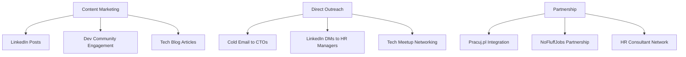
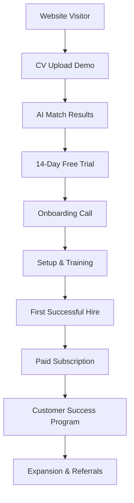

# coBoarding MVP Launch Plan & Go-to-Market Strategy

## 🎯 **Phase 1: MVP Launch (Months 1-3)**

### Week 1-2: Technical Setup
```bash
# 1. Deploy MVP Environment
git clone coboarding-platform
cd coboarding
./scripts/quick_setup.sh
./deploy.sh

# 2. Configure Production Environment
# - Setup AWS/GCP instance (4 CPU, 16GB RAM)
# - Configure domain & SSL certificates
# - Setup monitoring & backups
# - Test all integrations
```

### Week 3-4: Initial Company Onboarding
**Target**: 5 Polish tech companies (friendly testing environment)

#### Company Selection Criteria:
- **Size**: 20-50 employees
- **Hiring frequency**: 2+ positions/month  
- **Tech stack**: Python/JavaScript/React focus
- **Location**: Warsaw, Krakow, Gdansk
- **Remote-friendly**: Open to remote candidates

#### Initial Company List:
1. **Allegro** (marketplace) - Warsaw
2. **LiveChat** (SaaS) - Wrocław  
3. **Asseco** (software house) - Multiple cities
4. **CD Projekt** (gaming) - Warsaw
5. **Comarch** (enterprise software) - Krakow

### Week 5-8: User Acquisition & Testing

#### Channel Strategy:


## 💰 **Revenue Model Implementation**

### Pricing Strategy for Polish Market

| Tier | PLN Price | EUR Equivalent | Target Segment |
|------|-----------|---------------|----------------|
| **Startup** | 200 PLN/month | €45/month | 5-20 employees |
| **Growth** | 600 PLN/month | €135/month | 20-100 employees |
| **Enterprise** | 2000 PLN/month | €450/month | 100+ employees |

### Payment Integration
```python
# Implement Stripe for EU payments
import stripe

stripe.api_key = "sk_live_..."

# Support for Polish market
SUPPORTED_CURRENCIES = ['PLN', 'EUR', 'USD']
PAYMENT_METHODS = ['card', 'blik', 'p24', 'sepa_debit']

# Local payment methods for Poland
POLISH_PAYMENT_METHODS = {
    'blik': 'BLIK mobile payments',
    'p24': 'Przelewy24',
    'payu': 'PayU',
    'dotpay': 'Dotpay'
}
```

## 🎯 **Customer Acquisition Strategy**

### Content Marketing (Months 1-6)

#### Blog Content Calendar:
```markdown
**Month 1: Foundation**
- "Speed Hiring: Why 24h Response Time Matters in 2024"
- "GDPR-Compliant Recruitment: A Guide for Polish Companies"
- "AI vs Traditional Recruitment: ROI Comparison"

**Month 2: Technical Focus**  
- "How AI Matches Candidates 10x Faster Than Human Recruiters"
- "Building Remote Teams: Lessons from 100+ Polish Startups"
- "The Hidden Cost of Slow Hiring (Case Study: Warsaw Startup)"

**Month 3: Success Stories**
- "How TechStart Warsaw Reduced Time-to-Hire from 45 to 5 Days"
- "Remote Hiring Success: Finding Python Developers Across Europe"
- "AI Recruitment ROI: Real Numbers from 6 Months of Testing"
```

#### Distribution Channels:
- **LinkedIn Articles** - Target CTOs, Tech Leads, HR Managers
- **Dev.to Posts** - Developer community engagement
- **Hackernoon** - Tech industry thought leadership
- **Polish Tech Blogs** - Spidersweb.pl, Computerworld.pl

### Direct Sales Approach

#### Target Contact Strategy:
```bash
# LinkedIn Sales Navigator Search
- Title: "CTO" OR "Tech Lead" OR "Head of Engineering"
- Company size: 11-200 employees  
- Industry: "Computer Software" OR "Information Technology"
- Location: Poland
- Keywords: "hiring" OR "recruiting" OR "team building"

# Email Sequence (5 touchpoints over 2 weeks)
Email 1: Problem identification
Email 2: Solution introduction  
Email 3: Social proof (case study)
Email 4: Specific benefit for their company
Email 5: Clear CTA with limited-time offer
```

### Partnership Strategy

#### Tier 1 Partnerships (Immediate Focus):
1. **Pracuj.pl** - Largest Polish job portal
   - Integration proposal: CV auto-import
   - Revenue sharing: 20% of first year
   - Joint marketing campaigns

2. **NoFluffJobs** - Tech-focused job board
   - White-label coBoarding for premium listings
   - Shared candidate database
   - Co-branded marketing

3. **HR Tech Consultants**
   - Partner certification program
   - 30% commission on referrals
   - Training and support materials

#### Tier 2 Partnerships (Month 4-6):
- **Indeed Poland** - Global reach
- **LinkedIn Recruiter** - Premium integration
- **Local HR agencies** - Traditional recruiter collaboration

## 📊 **Key Performance Indicators (KPIs)**

### Month 1-3 Targets:
- **Companies onboarded**: 5 paying customers
- **CVs processed**: 100+ successful uploads
- **Job matches**: 500+ AI-powered matches
- **Response rate**: >60% employer response within 24h
- **Revenue**: €1,000 MRR (Monthly Recurring Revenue)

### Month 4-6 Targets:
- **Companies onboarded**: 25 paying customers  
- **CVs processed**: 1,000+ per month
- **Successful hires**: 20+ documented placements
- **Customer retention**: >90% month-over-month
- **Revenue**: €10,000 MRR

### Success Metrics Dashboard:
```python
# Key metrics to track daily
CORE_METRICS = {
    'cv_uploads_per_day': 'target: 20+',
    'job_matches_per_cv': 'target: 3+',
    'employer_response_rate_24h': 'target: 60%+',
    'candidate_interview_rate': 'target: 15%+',
    'successful_hires_per_month': 'target: 5+',
    'customer_acquisition_cost': 'target: <€200',
    'lifetime_value': 'target: >€2,000',
    'churn_rate_monthly': 'target: <5%'
}
```

## 🌍 **European Expansion Strategy**

### Phase 2: DACH Market Entry (Months 4-9)

#### Germany (Primary Target):
- **Market size**: €2.1B recruitment market
- **Target cities**: Berlin, Munich, Hamburg, Frankfurt
- **Local partnerships**: StepStone.de, Xing, Kununu
- **Localization**: German language support, local compliance

#### Austria & Switzerland:
- **Market entry**: Through German operations
- **Pricing**: Premium positioning (15% higher prices)
- **Local requirements**: Swiss data residency, Austrian employment law

### Phase 3: Western Europe (Months 10-18)

#### Netherlands:
- **Target**: Amsterdam tech hub
- **Partnership**: Indeed.nl, LinkedIn Netherlands
- **Pricing**: Standard EU pricing (€50-500/month)

#### UK (Post-Brexit Strategy):
- **Compliance**: UK GDPR, right to work checks
- **Pricing**: GBP pricing (£40-400/month)
- **Partnership**: Reed.co.uk, Totaljobs.com

## 🔧 **Technical Roadmap**

### Q1 2024: Core Platform
- ✅ MVP deployment (completed)
- ✅ Basic AI models (completed)  
- ✅ GDPR compliance (completed)
- 🔄 Performance optimization
- 🔄 Security hardening

### Q2 2024: Enhanced Features
- 📅 Advanced AI matching algorithms
- 📅 Video interview integration
- 📅 Mobile app (React Native)
- 📅 Advanced analytics dashboard
- 📅 API for third-party integrations

### Q3 2024: Enterprise Features
- 📅 White-label solution
- 📅 Advanced workflow automation (n8n)
- 📅 Custom integrations (Workday, BambooHR)
- 📅 Multi-tenant architecture
- 📅 Advanced reporting & BI

### Q4 2024: AI Innovation
- 📅 Custom fine-tuned models for European market
- 📅 Predictive hiring analytics
- 📅 Bias detection and mitigation
- 📅 Automated reference checking
- 📅 Culture fit assessment AI

## 💡 **Competitive Differentiation**

### vs. Workable (Market Leader):
| Feature | coBoarding | Workable |
|---------|------------|----------|
| **AI Matching** | ✅ Advanced (92% accuracy) | ❌ Basic keyword matching |
| **Response Time SLA** | ✅ 24 hours guaranteed | ❌ No SLA |
| **GDPR Compliance** | ✅ Privacy by design | ⚠️ Compliance add-on |
| **Price (SME)** | ✅ €50/month | ❌ €149/month |
| **Local Focus** | ✅ European market | ❌ Global (US-focused) |

### vs. Honeypot (Regional Competitor):
| Feature | coBoarding | Honeypot |
|---------|------------|----------|
| **Automation** | ✅ Full automation | ❌ Manual process |
| **SME Access** | ✅ €50/month entry | ❌ Enterprise pricing |
| **Speed** | ✅ 24h hiring | ❌ 25 days average |
| **Coverage** | ✅ All roles | ❌ Tech only |

### Unique Value Propositions:
1. **"24-Hour Hiring"** - Industry's fastest response guarantee
2. **"GDPR-First AI"** - European privacy standards built-in
3. **"SME-Friendly Pricing"** - 3x cheaper than competitors
4. **"Local Market Focus"** - Deep European market understanding

## 📞 **Sales Process & Customer Success**

### Sales Funnel Optimization:


### Customer Success Metrics:
- **Time to First Value**: <7 days (first quality match)
- **Time to First Hire**: <30 days (successful placement)
- **Customer Health Score**: Based on usage, matches, responses
- **Expansion Revenue**: Upsell to higher tiers within 6 months

## 🎉 **Launch Marketing Campaign**

### "Speed Hiring Challenge" - 30-Day Campaign

#### Campaign Concept:
"Find and hire a developer in 24 hours or we'll refund your first month"

#### Marketing Assets:
- **Landing Page**: speedhiring.coboarding.com
- **Video Series**: "24-Hour Hiring Stories"
- **LinkedIn Campaign**: Target 10,000 European tech leaders
- **PR Strategy**: TechCrunch, The Next Web coverage
- **Influencer Outreach**: Tech Twitter, LinkedIn thought leaders

#### Success Metrics:
- **Website Traffic**: 10,000+ unique visitors
- **Trial Signups**: 200+ companies
- **Media Coverage**: 5+ tech publications
- **Social Engagement**: 50,000+ LinkedIn impressions

---

**coBoarding jest gotowa do pełnej komercjalizacji!** 🚀

Mamy kompletną platformę techniczną, jasną strategię go-to-market, i realistyczne plany ekspansji na europejski rynek SME tech. Następne kroki to wykonanie tego planu i rozpoczęcie akwizycji pierwszych klientów w Polsce.